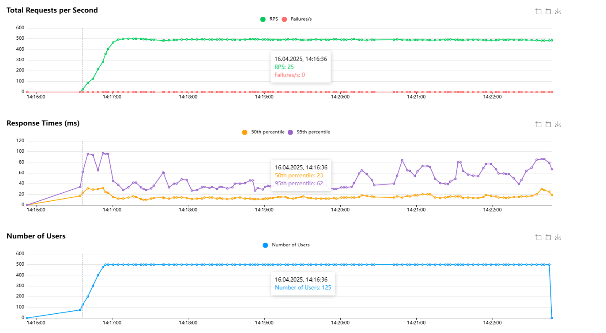
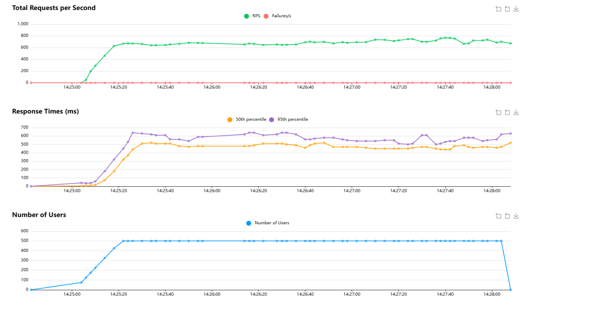
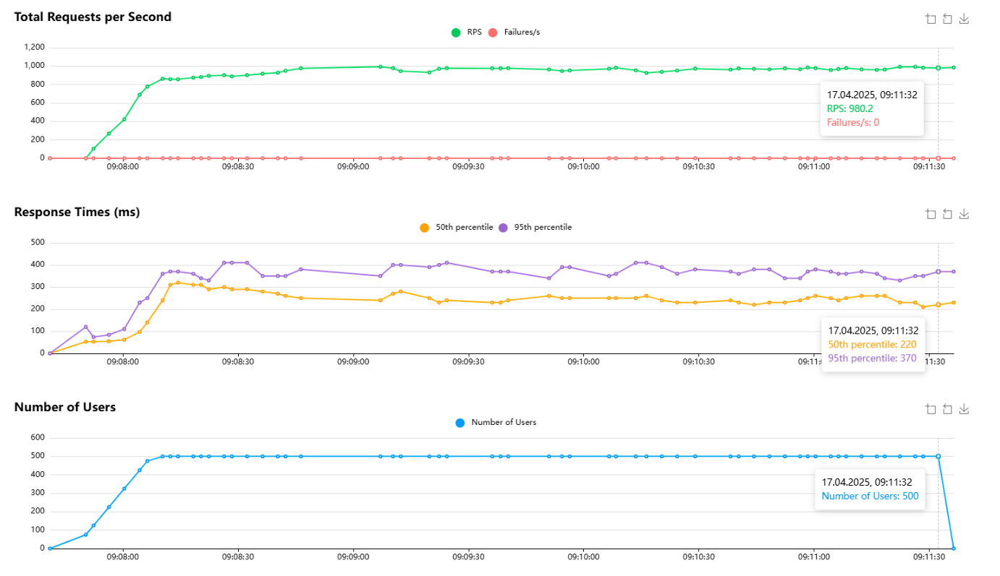

# Test #1

Настройки запуска нагрузочного тестирования. Увеличение пользователей на 25, всего пользователей 500, 1запрос/1секунда

На протяжении времени количество RPS держалось около 480-490, без срабатываний timeout'ов, или исключений.

CPU был загружен на 100%, через 5-10 секунд, после завершения тестирования, потребовалось, что бы задачи закончились из стека задач.

---

# Test #2

Настройки запуска нагрузочного тестирования. Увеличение пользователей на 25, всего пользователей 500, 4запросов/1секунда

На протяжении времени количество RPS держалось около 650-710, без срабатываний timeout'ов, или исключений.

CPU был загружен на 100%, через 20-30 секунд, после завершения тестирования, потребовалось, что бы задачи закончились из стека задач.

---

## Техническое оборудование:

* __CPU__ - AMD Ryzen 7 5800x 8-Core
* __RAM__ - DDR4 Kingston 2666 2 потока 4 плашки, каждая по 8 ГБ

---

## Замечания и наблюдения:

Во время тестирования, CPU в обоих случаев загружена на 100%, разница лишь в скорости пополнения стека задач (rabbitmq)

RAM в обоих случаев нагружался до 50-55%, сервисы все запускались в docker, тесты запускались локально (не внутри docker'a)

Во втором случае замечен баг, который в скором будет поправляться, в бд просочились дубликаты, а именно 4 дубликата прошли сквозь систему,
предполагаю, что 4 запроса отправилось и в redis и в db, 4 воркера в одно и тоже время взяли задачу, которые были одинаковы и выполнялись в одно и тоже время

Предполагаемое решение, смотреть в сторону redis....

---

# Test #3

Настройки запуска нагрузочного тестирования. Увеличение пользователей на 25, всего пользователей 500, 4запроса/1секунда

На протяжении времени количество RPS увеличилось до 970-990, без срабатываний timeout'ов, или исключений.

CPU был загружен на 60-70%.

---

## Замечания и наблюдение:

После исправления бага с дубликатом, производительность увеличилась, но нужно учесть, что все данные были одинаковы, 
следующее исследование будет проводиться при разном количестве данных у пользователей.

Техническая аппаратура не изменилась, CPU в последнем тесте было нагружено на 60-70%, а память в тех же цифрах 50-60%